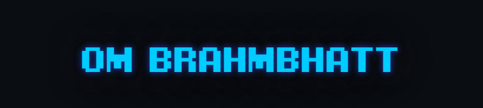

<div style="display:flex;">

</div>


```js
import FullStackEngineer from 'ombrahmbhatt';

class Bio extends FullStackEngineer {
  name     = 'Om Brahmbhatt';
  title    = 'IT Engineer';
  location = 'Anand, Gujarat';
}

class Skills extends FullStackEngineer {
  languages  = ['HTML', 'Python', 'JavaScript', 'PHP', 'Solidity'];
  databases  = ['MySQL', 'MongoDB', 'SQLite'];
  frameworks = ['React', 'React Native', 'Angular', 'GraphQL'];
}
```

<p align="center">
  </center>
</p>


<!--
**ombrahmbhatt/ombrahmbhatt** is a ✨ _special_ ✨ repository because its `README.md` (this file) appears on your GitHub profile.

Here are some ideas to get you started:

- 🔭 I’m currently working on ...
- 🌱 I’m currently learning ...
- 👯 I’m looking to collaborate on ...
- 🤔 I’m looking for help with ...
- 💬 Ask me about ...
- 📫 How to reach me: ...
- 😄 Pronouns: ...
- ⚡ Fun fact: ...
-->
